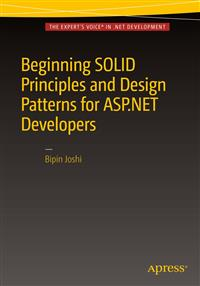

# Apress Source Code

This repository accompanies [*Beginning SOLID Principles and Design Patterns for ASP.NET  Developers*](http://www.apress.com/9781484218471) by Bipin Joshi (Apress, 2016).

Download the files as a zip using the green button, or clone the repository to your machine using Git.

## Updating to ASP.NET Core 1.0

If you have been reading this book, then you might have noticed that it uses RC1 of ASP.NET Core. After the book got published I updated the book's source code to RC2. Now that ASP.NET Core 1.0 is already released you might want to migrate the source code from RC2 to 1.0. To that end [this](http://www.binaryintellect.net/articles/458757c8-6a7a-4a3b-8ab2-e630f6d58585.aspx) article provides an outline of the steps involved in upgrading the book's source code from ASP.NET Core RC2 to ASP.NET Core 1.0.

## Releases

Release v1.0 corresponds to the code in the published book, without corrections or updates.

## Contributions

See the file Contributing.md for more information on how you can contribute to this repository.
